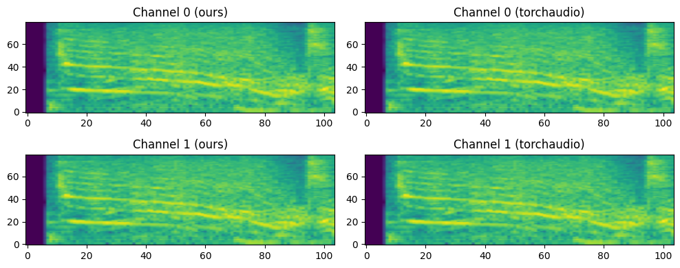
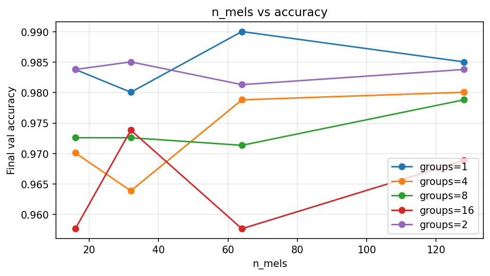
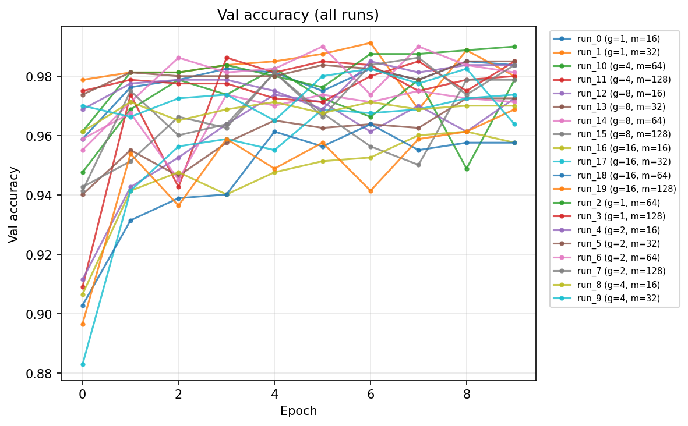
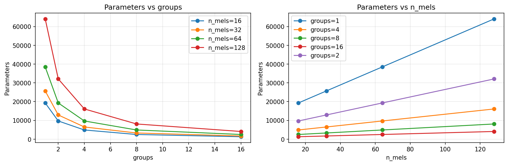
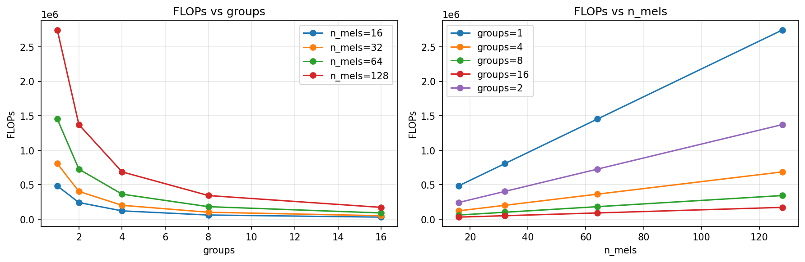
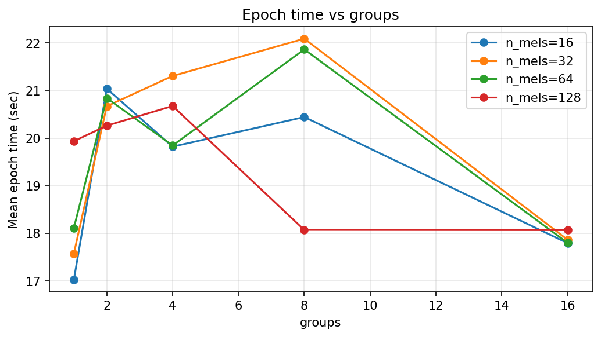

# Report: homework 1

## Part 1: LogMelFilterBanks

Here you can see plot of current implementation and torch one



Test for fair comparasion of torchaudio implementation and current one is located in [*tests/test_hw1/test_melbanks.py*](../tests/test_hw1/test_melbanks.py). It was done by iterating extensive set of possible input parameters on the same audio. 


## Part 2: Training Yes or No model

All training was done on Macbook air M4 with torch mps device. Full training code could be found here [src/shubuun/hw1/train.py](../src/shubuun/hw1/train.py).

To train and test all parameter set I made grid-search training with this grid:
```python
{
    "n_mels": [16, 32, 64, 128],
    "max_epochs": [10],
    "batch_size": [32],
    "lr": [1e-3],
    "groups": [1, 2, 4, 8, 16],
}
```

### Mels over val accuracy

Here is a graph with number of mels and final accuracy. Increase in number doesn't correlate strongly with increase in metric in all groups. However, we can see that `group=1` and `group=2` are dominant in metrics.



### Overall val accuracy over epochs. 

Here `g` is groups and `m` is number of mels. Best final metric was produced by `group=1&m=64`



### Performance

Here number of parameters for different groups and mels. We can clearly see that:
- the less groups -> more params
- the more mels -> more params
- the less group -> the more parameters increase for bigger mels

If we look into optimal combination given metrics, `group=8&n_mels64` gives optimal tradeoff. 



For computing FLOPs was used library thot which compute MACs, which were translated as roughly 2 times FLOPs Thus, Flops graphic is pretty much the same.



For training time graphic it is interesting that it doesn't follow FLOPs graphic. Reasons for this could be various ranging from optimizations tricks for specific groups (especially `group=1` default one) and just general non deterministic behaviour of computer when running with other processes in paralell.



## Conclusion

LogMelFilterBanks layer was implemented it matches torchaudio logmel output (see test in [*test_melbanks.py*](../tests/test_hw1/test_melbanks.py)). For Yes/No CNN, best val accuracy was `group=1`, `m=64`; `group=1` and `group=2` dominated. Fewer groups and more mels give more params and FLOPs; `group=8&n_mels=64` is a good tradeoff. Epoch time did not follow FLOPs, which is most probably due to parallel processes taking resources during training
