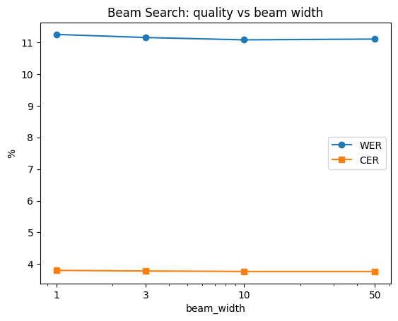
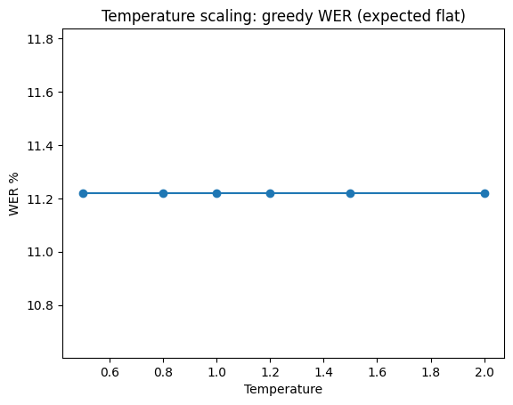
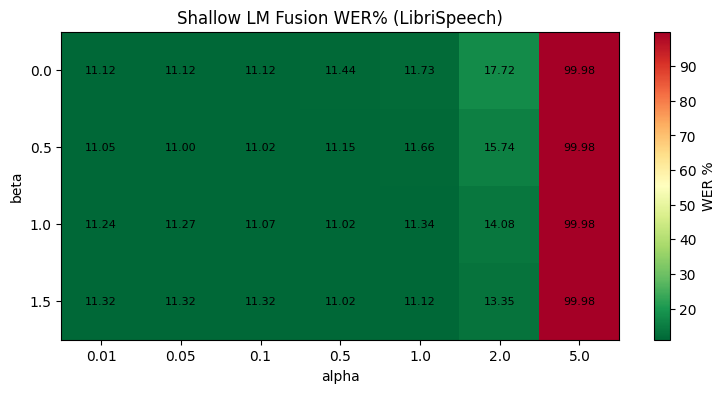
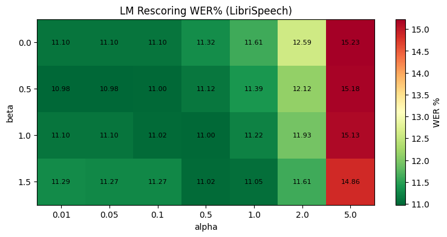
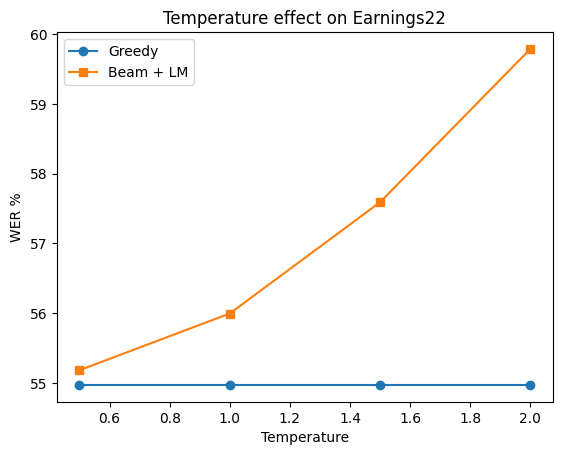
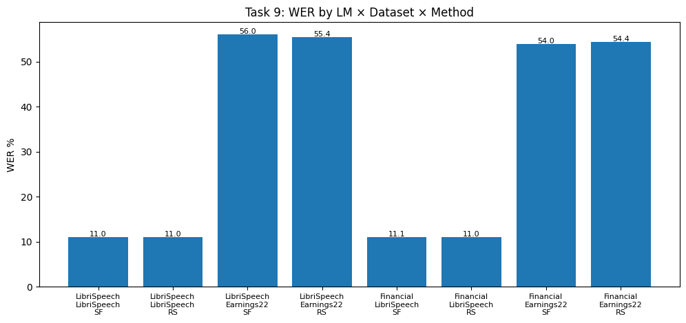

# Report: homework 2

## Part 1: CTC Decoding

### Task 1: Greedy Decode

На каждом timestep выбирается токен с наибольшей log-probability. Идущие подряд одинаковые токены дедуплицируются, blank-токены удаляются.

| Dataset | WER | CER |
|---|---|---|
| LibriSpeech test-other | 11.22% | 3.81% |

### Task 2: Beam Search

Beam search отслеживает top-`k` prefix-ов по суммарной CTC probability (суммируя все пути, которые сворачиваются к одному тексту). Для каждого beam хранятся два score: `p_blank` и `p_non_blank`.

| beam\_width | WER | CER |
|---|---|---|
| 1 | 11.24% | 3.80% |
| 3 | 11.15% | 3.78% |
| 10 | 11.07% | 3.77% |
| 50 | 11.10% | 3.77% |



Разброс по всем beam_width очень маленький (0.17% absolute WER), фактически это плато что и видно на графике. Небольшой прирост от 1 до 10 есть, но на 50 WER даже чуть отрастает обратно. Видимо, acoustic model достаточно уверена in-domain, и beam search мало что добавляет к greedy.

### Task 3: Temperature Scaling

Temperature T масштабирует logit-ы перед log-softmax: `logits / T`. Меньше T — распределение острее, больше T — более плоское.

| T | WER | CER |
|---|---|---|
| 0.5 | 11.22% | 3.81% |
| 0.8 | 11.22% | 3.81% |
| 1.0 | 11.22% | 3.81% |
| 1.2 | 11.22% | 3.81% |
| 1.5 | 11.22% | 3.81% |
| 2.0 | 11.22% | 3.81% |



**WER абсолютно не меняется при любой temperature.** Это ожидаемо: greedy decoding берёт `argmax`
---

## Part 2: Language Model Integration

### Task 4: Shallow LM Fusion (3-gram)

На каждом шаге расширения beam итоговый score считается как:

```
score = log_p_acoustic + alpha * log_p_lm + beta * num_words
```

LM запрашивается на границах слов (когда выбрасывается word delimiter `|`). Сделан sweep по `alpha ∈ {0.01, 0.05, 0.1, 0.5, 1.0, 2.0, 5.0}` и `beta ∈ {0.0, 0.5, 1.0, 1.5}`:



**Лучшая конфигурация: alpha=0.05, beta=0.5, WER=11.00%, CER=3.75%**

Основные наблюдения:
- Acoustic model уже хорошо работает in-domain, поэтому оптимальный alpha очень маленький (0.05). При alpha >= 2 качество резко падает, при alpha=5 LM полностью доминирует и WER стремится к 100%.
- Небольшой word insertion bonus (beta=0.5) чуть помогает - поощряет более полные гипотезы.

### Task 5: 4-gram LM

Используем лучшие alpha/beta из Task 4 (alpha=0.05, beta=0.5):

| LM | WER | CER |
|---|---|---|
| 3-gram (LibriSpeech) | 11.00% | 3.75% |
| 4-gram (LibriSpeech) | 11.02% | 3.76% |

4-gram LM не даёт никакого улучшения по сравнению с 3-gram. Поскольку `wav2vec2-base-100h` уже хорошо настроен на LibriSpeech read speech, bottleneck тут acoustic model. Более сильная LM не может компенсировать достигнутый потолок.

### Task 6: Second-pass LM Rescoring

Beam search (beam\_width=50, без LM) строит `N` гипотез с acoustic log-probabilities. Затем каждая rescoring-ом:

```
score = log_p_acoustic + alpha * log_p_lm + beta * num_words
```

Выбирается гипотеза с наибольшим итоговым score.



**Лучшая конфигурация: alpha=0.05, beta=0.5, WER=10.98%, CER=3.74%**

**Shallow fusion vs rescoring при beta=0:**

| alpha | SF WER% | RS WER% |
|---|---|---|
| 0.01 | 11.12 | 11.10 |
| 0.05 | 11.12 | 11.10 |
| 0.1 | 11.12 | 11.10 |
| 0.5 | 11.44 | 11.32 |
| 1.0 | 11.73 | 11.61 |
| 2.0 | 17.72 | 12.59 |
| 5.0 | 99.98 | 15.23 |

**Rescoring заметно стабильнее при больших значениях alpha.** При alpha=2 shallow fusion деградирует до 17.72% WER, а rescoring держится на 12.59%. При alpha=5 shallow fusion вообще коллапсирует до ~100% WER, тогда как rescoring — только 15.23%.

Причина в том, что при shallow fusion LM score влияет на то, какие beams выживают на каждом timestep. Большой alpha может уничтожить правильные acoustic paths прямо во время поиска, и восстановиться уже невозможно. При rescoring beam search сначала работает чисто акустически, все `N` гипотез сохраняются, а LM только переранжирует их в конце. Она не может уничтожить гипотезу, только переставить.

**Qualitative examples** (beam\_width=50, alpha=0.05, beta=0.5):

```
REF:  and the mere fact of his being there
BEAM: and the mere fact of his being their
SF:   and the mere fact of his being there   ✓ corrected
RS:   and the mere fact of his being there   ✓ corrected

REF:  he looked at her steadily
BEAM: he looked at her steadidly
SF:   he looked at her steadily              ✓ corrected
RS:   he looked at her steadily              ✓ corrected

REF:  it was a most beautiful voice
BEAM: it was a most beautiful voice
SF:   it was a most beautiful boys           ✗ introduced error
RS:   it was a most beautiful voice          ✓ unchanged

REF:  the door was shut and locked
BEAM: the door was shut and locked
SF:   the door was shut in locked            ✗ introduced error
RS:   the door was shut and locked           ✓ unchanged
```

---

## Task 7: Domain Shift: Earnings22

| Method | LibriSpeech WER | LibriSpeech CER | Earnings22 WER | Earnings22 CER |
|---|---|---|---|---|
| Greedy | 11.22% | 3.81% | 54.97% | 25.58% |
| Beam search | 11.10% | 3.77% | 55.03% | 25.36% |
| Beam + 3-gram (shallow fusion) | 11.00% | 3.75% | 55.99% | 25.42% |
| Beam + 3-gram (rescoring) | 10.98% | 3.74% | 55.51% | 25.39% |

Разрыв между in-domain (LibriSpeech) и out-of-domain (Earnings22) огромный: ~11% vs ~55% WER. Две вероятные причины:

1. **Acoustic mismatch** — `wav2vec2-base-100h` обучался на чистой речи. В финансовых спонтанная речь, жаргон и разные условия записи.

2. **LM mismatch** — LibriSpeech 3-gram обучен на книгах и газетных текстах. Финансовой лексики нет. Shallow fusion с такой LM активно *вредит* (55.99% против 55.03% для plain beam): она штрафует правильные доменные слова и продвигает общие альтернативы.

### Task 7b: Temperature × LM Fusion на Earnings22



| T | Greedy WER | Beam + LM WER |
|---|---|---|
| 0.5 | 54.97% | 55.18% |
| 1.0 | 54.97% | 55.99% |
| 1.5 | 54.97% | 57.59% |
| 2.0 | 54.97% | 59.79% |

- **Greedy плоский** (ожидаемо, argmax invariance работает независимо от домена).
- **Beam + LM монотонно деградирует с ростом temperature.** Более высокое T сглаживает acoustic distribution, давая LM относительно больше влияния. Но LibriSpeech LM не совпадает с финансовой речью, поэтому больше LM = больше ошибок. При T=2.0 WER достигает 59.79%.
- На LibriSpeech T > 1 тоже ухудшает качество, потому что acoustic model хорошо откалибрована и не нуждается в коррекции. На Earnings22 acoustic model плохо откалибрована *и* LM не соответствует домену, так что рост T бьёт сразу с двух сторон. Для улучшения здесь нужна domain-matched LM.

---

## Task 8: Financial-domain KenLM

3-gram KenLM model обучена на `data/earnings22_train/corpus.txt` (~5000 строк, ~100k слов)
---

## Task 9: Обе LM Оба датасета

Лучший метод декодирования: beam\_width=50, alpha=0.05, beta=0.5.

| LM | Dataset | Method | WER | CER |
|---|---|---|---|---|
| LibriSpeech 3-gram | LibriSpeech | Shallow fusion | 11.00% | 3.75% |
| LibriSpeech 3-gram | LibriSpeech | Rescoring | 10.98% | 3.74% |
| LibriSpeech 3-gram | Earnings22 | Shallow fusion | 55.99% | 25.42% |
| LibriSpeech 3-gram | Earnings22 | Rescoring | 55.42% | 25.40% |
| Financial 3-gram | LibriSpeech | Shallow fusion | 11.07% | 3.77% |
| Financial 3-gram | LibriSpeech | Rescoring | 11.05% | 3.76% |
| Financial 3-gram | Earnings22 | Shallow fusion | 53.98% | 25.22% |
| Financial 3-gram | Earnings22 | Rescoring | 54.40% | 25.29% |



**Какая LM лучше in-domain (LibriSpeech)?** LibriSpeech 3-gram (10.98% против 11.05%). Ожидаемо: лексика и n-gram статистика прямо совпадают с тестовым доменом.

**Какая LM лучше out-of-domain (Earnings22)?** Financial 3-gram (53.98% SF, 54.40% RS против 55.99%/55.42% для LibriSpeech LM). Domain-matched LM возвращает ~2% absolute WER за счёт покрытия финансовой лексики, которую LibriSpeech LM штрафует.

**Помогает ли domain-matched LM больше, чем большая general LM?** Да. Сравнивая Task 5 (4-gram LibriSpeech, 11.02%) и Financial 3-gram на LibriSpeech (11.05%): большая general LM незначительно побеждает маленькую domain LM in-domain. Но на Earnings22 domain-matched LM выигрывает у большой general LM на ~2% absolute. Соответствие домену важнее размера модели для out-of-domain данных.

Интересно, что даже с financial LM, WER на Earnings22 остаётся ~54%. Acoustic mismatch — доминирующий bottleneck. Для существенного улучшения нужна domain-adapted acoustic model.
